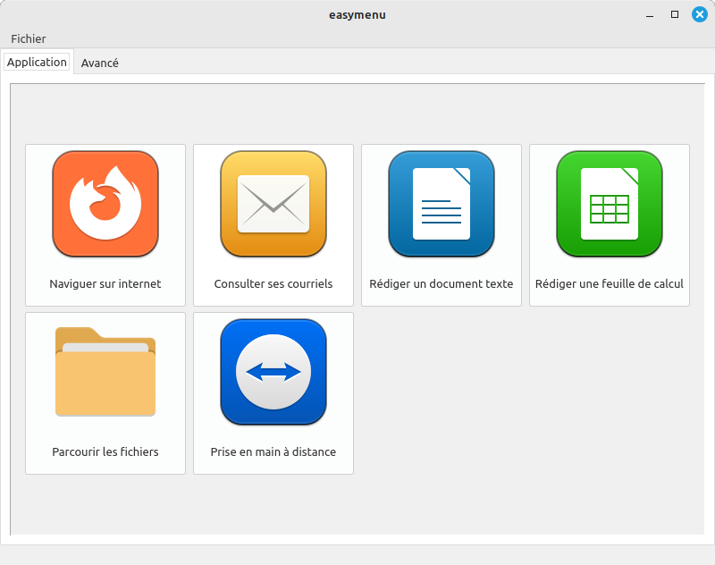
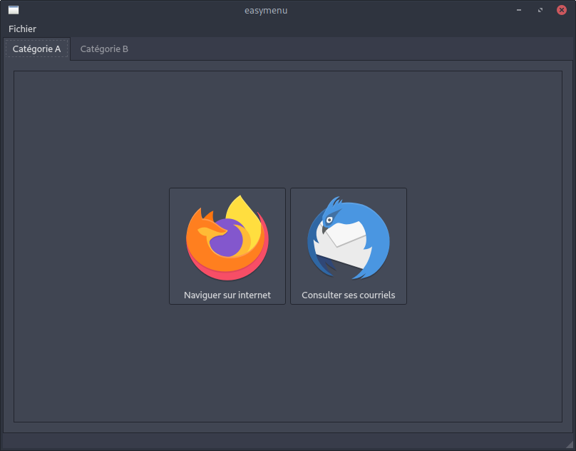

# Easy Menu

Inspiré par l'Handy Menu ([https://debian-facile.org/git/ProjetsDF/handymenu](https://debian-facile.org/git/ProjetsDF/handymenu)) ([https://framagit.org/Steph/handymenu-primtux](https://framagit.org/Steph/handymenu-primtux)).

Cette application à pour but de permettre d’être un remplacement simple aux lanceurs d'applications traditionnels afin de simplifier l'utilisation d'outils informatiques aux personnes débutantes.



## La configuration du menu

La configuration du menu se fait dans un fichier **json** stocké dans le dossier le dossier config de l'utilisateur courant: **~/.config/easymenu.json**.

### Squelette de base du fichier de configuration

Voici un exemple de capture d'écran ainsi que son fichier de configuration associé:



```json
{
    "buttons_size": 164, // Taille des boutons (obligatoire, pas de valeur par défaut)
    "buttons_per_row": 4, // Nombre de boutons par lignes (obligatoire, pas de valeur par défaut)

    "categories": // Une liste contenant chaque catégorie. Chaque catégorie s'affiche dans un onglet différent
    [
        // Onglet N°1
        {
            "label": "Catégorie A", // Le nom qui sera affiché dans l'onglet (obligatoire, pas de valeur par défaut)
            "applications": // Liste qui contiends les applications de chaque catégorie (obligatoire)
            [
         		// Application N°1
                {
                    "label": "Naviguer sur internet", // Nom de l'application (obligatoire)
                    "icon": "firefox", // Nom de l'icône à afficher (se base directement sur le thême QT utilisé) (optionnel mais recommandé)
                    "comment": "Firefox", // Commentaire qui est affiché quand on passage la souris sur bouton (optionnel)
                    "executable": "/usr/bin/firefox" // Chemin entier de l'exécutable à lancer (obligatoire)
                },

				// Application N°2
                {
                    "label": "Consulter ses courriels",
                    "icon": "thunderbird",
                    "comment": "Thuderbird",
                    "executable": "/usr/bin/thunderbird"
                }
            ]
        },

        // Onglet N°2
        {
            "label": "Catégorie B",
            "applications":
            [
            	{
                    "label": "Consulter ses courriels",
                    "icon": "thunderbird",
                    "comment": "Thuderbird",
                    "executable": "/usr/bin/thunderbird"
                },
          		{
                    "label": "Naviguer sur internet",
                    "icon": "firefox",
                    "comment": "Firefox",
                    "executable": "/usr/bin/firefox"
                }
            ]
        }
    ]
}
```

